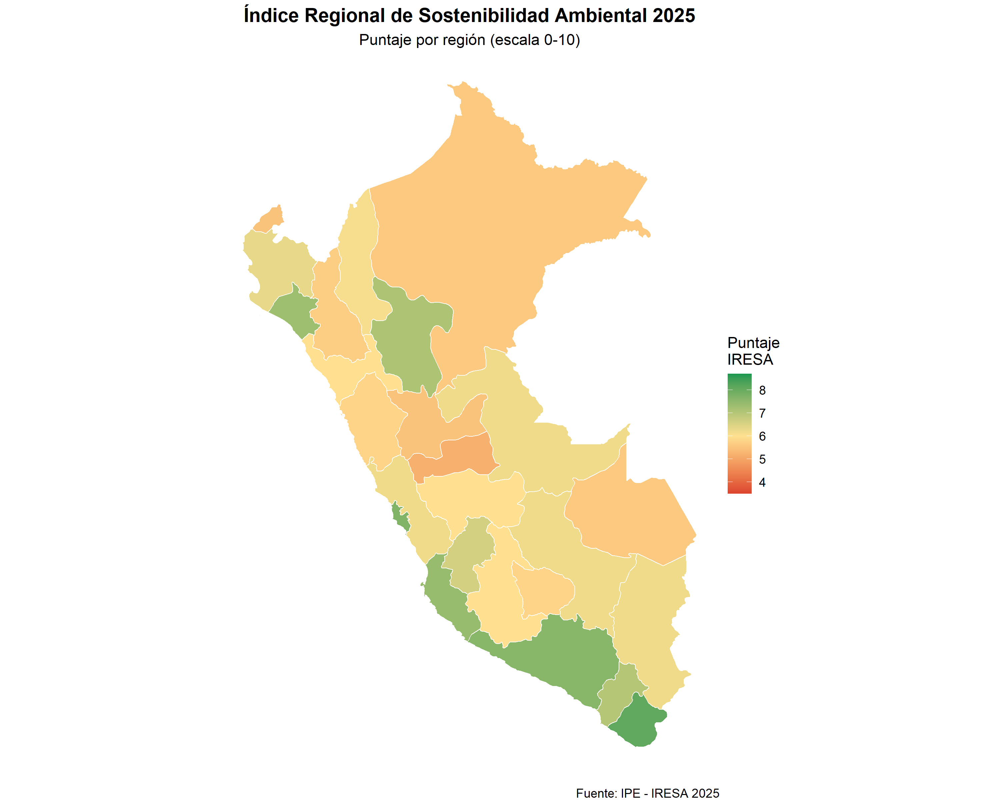
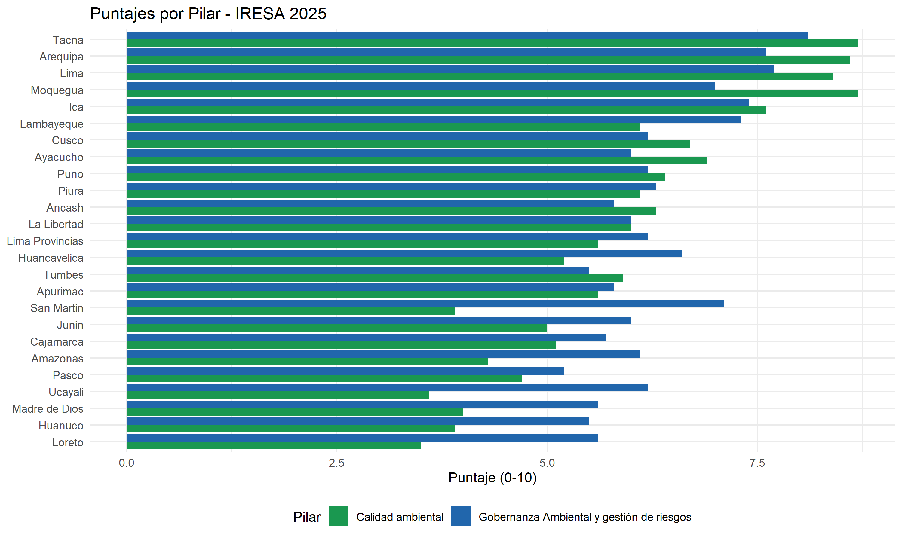
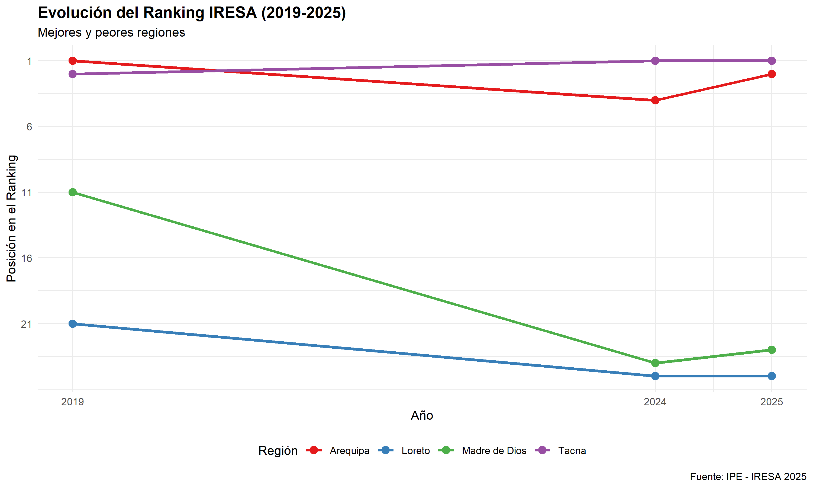

<!-- README.md is generated from README.Rmd. Please edit that file -->

# iresa 

<!-- badges: start -->

[](https://github.com/ipe-org/iresa/actions/workflows/R-CMD-check.yaml)
[](https://app.codecov.io/gh/ipe-org/iresa?branch=main)
[](https://lifecycle.r-lib.org/articles/stages.html#experimental)
[](https://CRAN.R-project.org/package=iresa)
<!-- badges: end -->

## Descripción

El paquete `iresa` proporciona acceso completo a los datos del **Índice
Regional de Sostenibilidad Ambiental (IRESA)** del Perú, desarrollado
por el Instituto Peruano de Economía (IPE) para medir y comparar el
desempeño ambiental de las 25 regiones del país.

### ¿Por qué es importante?

La disponibilidad de recursos naturales y su manejo eficiente son
factores decisivos para sostener la productividad y preservar el
bienestar de la población. El deterioro ambiental reduce las
oportunidades de crecimiento económico y compromete el desarrollo
sostenible.

En el Perú: - **151 mil hectáreas** de bosques amazónicos se perdieron
en 2024 (62% más que hace 20 años) - **56% de los glaciares andinos**
han retrocedido, comprometiendo la seguridad hídrica - El país es el
**11° más vulnerable** a desastres naturales (World Risk Report 2024) -
**60% de la población** vive en la costa que concentra menos del 2% del
agua dulce

## ¿Qué es el IRESA?

El IRESA evalúa la capacidad de las regiones para enfrentar los desafíos
ambientales actuales mediante **14 indicadores** agrupados en dos
pilares complementarios:

### 🌿 Pilar I: Calidad Ambiental (7 indicadores)

Evalúa el estado físico, químico y biológico del entorno natural:

| Indicador | Descripción | Unidad |
|----|----|----|
| **Tratamiento de aguas residuales** | % de aguas residuales tratadas por EPS | Porcentaje |
| **Calidad del aire** | Concentración de PM2.5 | µg/m³ |
| **Acceso a agua segura** | % población con niveles adecuados de cloro residual | Porcentaje |
| **Consumo de energías limpias** | % hogares usando gas natural, GLP o electricidad | Porcentaje |
| **Generación de residuos** | kg de residuos por cada S/1,000 de PBI | kg/S/1,000 PBI |
| **Degradación de ecosistemas** | % de ecosistemas degradados | Porcentaje |
| **Disposición adecuada de residuos** | % población con acceso a rellenos sanitarios o reciclaje | Porcentaje |

### 🏛️ Pilar II: Gobernanza Ambiental y Gestión de Riesgos (7 indicadores)

Mide la capacidad institucional para prevenir, mitigar y responder a
riesgos ambientales:

| Indicador | Descripción | Unidad |
|----|----|----|
| **Conflictos socioambientales** | Conflictos activos por 100,000 habitantes | Tasa |
| **Delitos por minería ilegal** | Denuncias por cada 10,000 habitantes | Tasa |
| **Áreas verdes conservadas** | m² conservados por habitante | m²/hab |
| **Agua no facturada** | % de agua producida sin generar ingresos | Porcentaje |
| **Viviendas informales** | % de viviendas informales | Porcentaje |
| **Pérdidas por incendios forestales** | % de superficie dañada o destruida | Porcentaje |
| **Ejecución del gasto en prevención** | % del presupuesto ejecutado | Porcentaje |

### Metodología

- **Normalización**: Los indicadores se transforman a una escala de 0 a
  10 usando valores máximos y mínimos históricos (2018-2024)
- **Agregación**: El puntaje de cada pilar es el promedio simple de sus
  indicadores
- **Índice general**: El IRESA es el promedio de ambos pilares
- **Rankings**: Se calculan usando `min_rank()` para manejar
  correctamente empates

### Cobertura Temporal

| Edición    | Datos actualizados a | Años disponibles |
|------------|----------------------|------------------|
| IRESA 2025 | 2024                 | 2019, 2024, 2025 |
| IRESA 2024 | 2023                 | 2019, 2023, 2024 |
| IRESA 2019 | 2018                 | Año base         |

## Instalación

Puedes instalar la versión en desarrollo desde
[GitHub](https://github.com/):

``` r
# install.packages("pak")
pak::pak("PaulESantos/iresa")
```

## Inicio Rápido

### Cargar el paquete

``` r
library(iresa)
library(dplyr)
library(ggplot2)
```

### Explorar los datasets

``` r
# Número de regiones y años
iresa_general |>
  filter(indice_pilar == "IRESA") |>
  summarise(
    n_regiones = n_distinct(region),
    años = paste(unique(c(2019, 2024, 2025)), collapse = ", ")
  )
#> # A tibble: 1 × 2
#>   n_regiones años            
#>        <int> <chr>           
#> 1         25 2019, 2024, 2025
```

### Top 10 Regiones - IRESA 2025

``` r
iresa_general |>
  filter(indice_pilar == "IRESA") |>
  select(region, rank_2025, score_2025, score_2019) |>
  arrange(rank_2025) |>
  slice(1:10) |>
  knitr::kable(
    col.names = c("Región", "Ranking", "Puntaje 2025", "Puntaje 2019"),
    digits = 2
  )
```

| Región     | Ranking | Puntaje 2025 | Puntaje 2019 |
|:-----------|--------:|-------------:|-------------:|
| Tacna      |       1 |         8.40 |          7.9 |
| Arequipa   |       2 |         8.10 |          8.0 |
| Lima       |       3 |         8.05 |          7.7 |
| Moquegua   |       4 |         7.80 |          7.5 |
| Ica        |       5 |         7.50 |          6.7 |
| Lambayeque |       6 |         6.70 |          5.6 |
| Ayacucho   |       7 |         6.50 |          6.2 |
| Cusco      |       8 |         6.40 |          5.8 |
| Puno       |       9 |         6.30 |          6.1 |
| Piura      |      10 |         6.20 |          5.4 |

### Comparación por Pilares

``` r
# Líderes por pilar
iresa_general |>
  filter(indice_pilar != "IRESA", rank_2025 <= 3) |>
  select(indice_pilar, region, rank_2025, score_2025) |>
  arrange(indice_pilar, rank_2025) |>
  knitr::kable(
    col.names = c("Pilar", "Región", "Ranking", "Puntaje"),
    digits = 2
  )
```

| Pilar                                     | Región   | Ranking | Puntaje |
|:------------------------------------------|:---------|--------:|--------:|
| Calidad ambiental                         | Tacna    |       1 |     8.7 |
| Calidad ambiental                         | Moquegua |       2 |     8.7 |
| Calidad ambiental                         | Arequipa |       3 |     8.6 |
| Gobernanza Ambiental y gestión de riesgos | Tacna    |       1 |     8.1 |
| Gobernanza Ambiental y gestión de riesgos | Lima     |       2 |     7.7 |
| Gobernanza Ambiental y gestión de riesgos | Arequipa |       3 |     7.6 |

## Análisis Avanzados

### 1. Rankings con Manejo de Empates

``` r
# Calcular ranking de acceso a agua segura
ranking_agua <- calidad_ambiental |>
  filter(indicador == "Acceso a agua segura") |>
  calcular_ranking_indicador(year = 2025, compare_with_2019 = TRUE)

# Identificar empates
empates <- identificar_empates(ranking_agua)

if (nrow(empates) > 0) {
  cat("Regiones con empates:\n")
  empates |>
    select(region, score_2025, rank_2025) |>
    knitr::kable()
}
#> Regiones con empates:
```

| region    | score_2025 | rank_2025 |
|:----------|-----------:|----------:|
| Cajamarca |       12.5 |        19 |
| Tumbes    |       12.5 |        19 |

### 2. Evolución Temporal (2019-2025)

``` r
# Regiones con mayor mejora
iresa_general |>
  filter(indice_pilar == "IRESA") |>
  calcular_ranking_indicador(year = 2025) |>
  filter(tendencia %in% c("Mejora significativa", "Mejora")) |>
  arrange(desc(cambio_rank)) |>
  select(region, rank_2025, rank_2019, cambio_rank, tendencia) |>
  head(5) |>
  knitr::kable(
    col.names = c("Región", "Rank 2025", "Rank 2019", "Cambio", "Tendencia")
  )
```

| Región          | Rank 2025 | Rank 2019 | Cambio | Tendencia            |
|:----------------|----------:|----------:|-------:|:---------------------|
| Huancavelica    |        13 |        23 |     10 | Mejora significativa |
| Lambayeque      |         6 |        10 |      4 | Mejora               |
| Ucayali         |        21 |        25 |      4 | Mejora               |
| Piura           |        10 |        13 |      3 | Mejora               |
| Lima Provincias |        13 |        16 |      3 | Mejora               |

### 3. Perfil Regional Completo

``` r
# Análisis detallado de Tacna (región líder)
ranking_completo <- calcular_rankings_completo(calidad_ambiental, year = 2025)

obtener_ranking_region(ranking_completo, "Tacna") |>
  select(indicador, rank_2025, score_2025, cambio_rank, tendencia) |>
  arrange(rank_2025) |>
  knitr::kable(
    col.names = c("Indicador", "Ranking", "Puntaje", "Cambio vs 2019", "Tendencia")
  )
```

| Indicador | Ranking | Puntaje | Cambio vs 2019 | Tendencia |
|:---|---:|---:|---:|:---|
| Calidad del aire | 2 | 14.1 | 0 | Estable |
| Tratamiento de aguas residuales | 2 | 98.1 | 8 | Mejora significativa |
| Acceso a agua segura | 3 | 52.5 | 1 | Mejora |
| Degradación de ecosistemas | 3 | 1.2 | 1 | Mejora |
| Consumo de energías limpias | 4 | 94.6 | 19 | Mejora significativa |
| Disposición adecuada de residuos | 6 | 80.3 | -3 | Deterioro |
| Generación total de residuos sólidos municipales ajustados por PBI | 6 | 5.9 | 0 | Estable |

### 4. Análisis por Indicador Específico

``` r
# Calidad del aire: regiones con mejor desempeño
calidad_ambiental |>
  filter(indicador == "Calidad del aire") |>
  calcular_ranking_indicador(year = 2025, ascending = TRUE) |>  # Valores bajos = mejor
  slice(1:5) |>
  select(region, score_2025, rank_2025, cambio_score) |>
  knitr::kable(
    col.names = c("Región", "PM2.5 (µg/m³)", "Ranking", "Cambio vs 2019"),
    digits = 1
  )
```

| Región   | PM2.5 (µg/m³) | Ranking | Cambio vs 2019 |
|:---------|--------------:|--------:|---------------:|
| Arequipa |          13.8 |       1 |            2.2 |
| Tacna    |          14.1 |       2 |            1.9 |
| Moquegua |          15.4 |       3 |            2.9 |
| Tumbes   |          18.9 |       4 |            1.4 |
| Amazonas |          19.3 |       5 |            1.8 |

## Visualizaciones

### Mapa Temático del IRESA 2025

``` r
library(sf)

peru_mapa |>
  left_join(iresa_general |> select(region, score_2025), by = "region") |>
  ggplot() +
  geom_sf(aes(fill = score_2025), color = "white", size = 0.3) +
  scale_fill_gradient2(
    name = "Puntaje\nIRESA",
    low = "#d73027",
    mid = "#fee090",
    high = "#1a9850",
    midpoint = 6,
    breaks = seq(4, 9, 1)
  ) +
  labs(
    title = "Índice Regional de Sostenibilidad Ambiental 2025",
    subtitle = "Puntaje por región (escala 0-10)",
    caption = "Fuente: IPE - IRESA 2025"
  ) +
  theme_void() +
  theme(
    plot.title = element_text(face = "bold", size = 14, hjust = 0.5),
    plot.subtitle = element_text(size = 11, hjust = 0.5),
    legend.position = "right"
  )
```



### Comparación de Pilares

``` r
iresa_general |>
  filter(indice_pilar != "IRESA") |>
  select(indice_pilar, region, score_2025) |>
  ggplot(aes(x = reorder(region, score_2025), y = score_2025, fill = indice_pilar)) +
  geom_col(position = "dodge") +
  coord_flip() +
  scale_fill_manual(
    values = c("Calidad ambiental" = "#1a9850", 
               "Gobernanza Ambiental y gestión de riesgos" = "#2166ac")
  ) +
  labs(
    title = "Puntajes por Pilar - IRESA 2025",
    x = NULL,
    y = "Puntaje (0-10)",
    fill = "Pilar"
  ) +
  theme_minimal() +
  theme(legend.position = "bottom")
```



### Evolución Temporal de Regiones Seleccionadas

``` r
library(tidyr)

regiones_interes <- c("Tacna", "Arequipa", "Lima*", "Loreto", "Madre de Dios")

iresa_general |>
  filter(
    indice_pilar == "IRESA",
    region %in% regiones_interes
  ) |>
  select(region, rank_2019, rank_2024, rank_2025) |>
  pivot_longer(
    cols = starts_with("rank"),
    names_to = "year",
    values_to = "ranking"
  ) |>
  mutate(year = as.numeric(gsub("rank_", "", year))) |>
  ggplot(aes(x = year, y = ranking, color = region, group = region)) +
  geom_line(linewidth = 1.2) +
  geom_point(size = 3) +
  scale_y_reverse(breaks = seq(1, 25, 5)) +
  scale_x_continuous(breaks = c(2019, 2024, 2025)) +
  scale_color_brewer(palette = "Set1") +
  labs(
    title = "Evolución del Ranking IRESA (2019-2025)",
    subtitle = "Mejores y peores regiones",
    x = "Año",
    y = "Posición en el Ranking",
    color = "Región",
    caption = "Fuente: IPE - IRESA 2025"
  ) +
  theme_minimal() +
  theme(
    plot.title = element_text(face = "bold", size = 14),
    legend.position = "bottom"
  )
```



## Estructura de Datos

El paquete incluye **4 datasets** complementarios:

### 1. `iresa_general` - Resumen por Índice y Pilares (75 × 8)

Formato largo para análisis comparativos entre índice general y pilares.

``` r
iresa_general |>
  count(indice_pilar)
#> # A tibble: 3 × 2
#>   indice_pilar                                  n
#>   <chr>                                     <int>
#> 1 Calidad ambiental                            25
#> 2 Gobernanza Ambiental y gestión de riesgos    25
#> 3 IRESA                                        25
```

### 2. `calidad_ambiental` - Indicadores de Calidad Ambiental (175 × 8)

Detalle de los 7 indicadores del Pilar I.

``` r
calidad_ambiental |>
  count(indicador)
#> # A tibble: 7 × 2
#>   indicador                                                              n
#>   <chr>                                                              <int>
#> 1 Acceso a agua segura                                                  25
#> 2 Calidad del aire                                                      25
#> 3 Consumo de energías limpias                                           25
#> 4 Degradación de ecosistemas                                            25
#> 5 Disposición adecuada de residuos                                      25
#> 6 Generación total de residuos sólidos municipales ajustados por PBI    25
#> 7 Tratamiento de aguas residuales                                       25
```

### 3. `gobernanza_gestion` - Indicadores de Gobernanza (175 × 8)

Detalle de los 7 indicadores del Pilar II.

``` r
gobernanza_gestion |>
  count(indicador)
#> # A tibble: 7 × 2
#>   indicador                                                               n
#>   <chr>                                                               <int>
#> 1 Agua no facturada                                                      25
#> 2 Conflictos socioambientales activos                                    25
#> 3 Delitos denunciados por minería ilegal                                 25
#> 4 Ejecución del gasto destinado a prevención y reducción de desastres    25
#> 5 Pérdidas por incendios forestales                                      25
#> 6 Viviendas informales                                                   25
#> 7 Áreas verdes en espacios públicos conservadas por la municipalidad     25
```

### 4. `peru_mapa` - Geometrías Espaciales (25 × 2)

Objeto `sf` con polígonos de las regiones para visualizaciones
cartográficas.

``` r
library(sf)
st_crs(peru_mapa)
#> Coordinate Reference System:
#>   User input: WGS 84 
#>   wkt:
#> GEOGCRS["WGS 84",
#>     DATUM["World Geodetic System 1984",
#>         ELLIPSOID["WGS 84",6378137,298.257223563,
#>             LENGTHUNIT["metre",1]]],
#>     PRIMEM["Greenwich",0,
#>         ANGLEUNIT["degree",0.0174532925199433]],
#>     CS[ellipsoidal,2],
#>         AXIS["latitude",north,
#>             ORDER[1],
#>             ANGLEUNIT["degree",0.0174532925199433]],
#>         AXIS["longitude",east,
#>             ORDER[2],
#>             ANGLEUNIT["degree",0.0174532925199433]],
#>     ID["EPSG",4326]]
```

## Funciones Principales

| Función | Descripción |
|----|----|
| `calcular_ranking_indicador()` | Calcula rankings con manejo correcto de empates |
| `calcular_rankings_completo()` | Procesa todos los indicadores automáticamente |
| `obtener_ranking_region()` | Extrae ranking de una región específica |
| `identificar_empates()` | Encuentra regiones con misma posición |
| `validar_ranking()` | Verifica consistencia de rankings calculados |

## Contexto Nacional

### Principales Desafíos Ambientales del Perú

**🌳 Deforestación Amazónica** - 3.2 millones de hectáreas perdidas
(2001-2024) - Promedio anual: 155 mil hectáreas - Principales causas:
expansión agrícola (49%), cultivos ilícitos (75% en zonas recientes)

**⛏️ Minería Ilegal** - Exportaciones ilegales de oro: \>US\$ 12,000
millones en 2025 - Madre de Dios: 180 toneladas de mercurio liberadas
anualmente - 98.7% de deforestación minera concentrada en regiones del
sur

**💧 Calidad del Agua** - Solo 39% de la población accede a agua con
niveles adecuados de cloro - 38.5% de agua no facturada a nivel
nacional - 18 de 50 EPS sin plantas de tratamiento operativas

**🌡️ Calidad del Aire** - Perú entre los 50 países más contaminados del
mundo - PM2.5 reduce esperanza de vida en 1.9 años promedio - Regiones
más afectadas: Madre de Dios, Lambayeque, Lima Metropolitana

**🔥 Gestión de Riesgos** - 12,388 emergencias por desastres naturales
en 2023 - Solo 30.5% de municipalidades con planes de prevención
vigentes - 24,950 incendios forestales en 2024 (récord desde 2010)

## Citación

Si utilizas este paquete en tu investigación, por favor cita:

``` r
citation("iresa")
```

> Instituto Peruano de Economía (2025). *Índice Regional de
> Sostenibilidad Ambiental (IRESA) 2025*. Lima, Perú.
> <https://www.ipe.org.pe/portal/iresa/>

**Formato BibTeX:**

``` bibtex
@Manual{iresa2025,
  title = {iresa: Índice Regional de Sostenibilidad Ambiental del Perú},
  author = {{Paul E. Santos Andrade}},
  year = {2025},
  note = {R package version 0.1.0},
  url = {https://github.com/ipe-org/iresa},
}
```

## Recursos Adicionales

- 📊 [Informe completo IRESA
  2025](https://incore-spaces.nyc3.digitaloceanspaces.com/documents/1762188727_%C3%8Dndice_Regional_de_Sostenibilidad_Ambiental_-_IRESA_2025_1762188727.pdfhttps://www.ipe.org.pe/portal/iresa/)
- 🗺️ [Visualizador
  interactiov](https://incoreperu.pe/indices/iresa-indice-regional-de-sostenibilidad-ambiental/)

## Contribuir

Las contribuciones son bienvenidas. Por favor:

1.  **Reportar problemas**: Abre un
    [issue](https://github.com/PaulESantos/iresa/issues) para bugs o
    sugerencias
2.  **Proponer mejoras**: Crea un pull request con tus cambios
3.  **Ejecutar tests**: Asegúrate de que `devtools::test()` pase sin
    errores
4.  **Documentar cambios**: Actualiza NEWS.md y documentación

### Configuración de Desarrollo

``` r
# Clonar repositorio
# git clone https://github.com/PaulESantos/iresa.git
# cd iresa

# Instalar dependencias de desarrollo
devtools::install_dev_deps()

# Verificar package
devtools::check()

# Construir documentación
devtools::document()

# Ejecutar tests
devtools::test()
```

------------------------------------------------------------------------

**Desarrollado por:** Paul E. Santos Andrade (<paulefrens@gmail.com>)  
**Sitio web IPE:** <https://www.ipe.org.pe>
